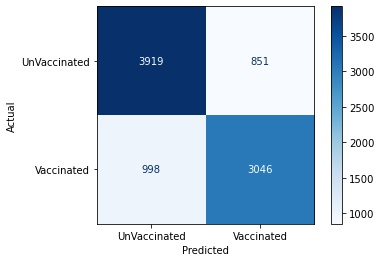

# Flu-Shot-Learning

- Zachary Rauch: 
[LinkedIn](https://www.linkedin.com/in/zach-rauch/) |
[GitHub](https://github.com/ZachRauch)|
[Email](zach.rauch0@gmail.com)

## Business Problem

## Data

## Model 




## Most Important Features


## Conclosions

## Next Steps

## Repository Structure
---
```
├── data  
│
├── Workspace
├── images
├── .gitignore
├── Predicting Seasonal Vaccine Status.ipynb
├── README.md
├── avg2_model.sav
├── model2.py
├── tuned_etc.sav
└── tuned_forest.sav
```
