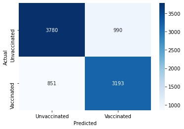
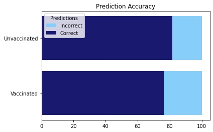

# Flu-Shot-Learning

- Zachary Rauch: 
[LinkedIn](https://www.linkedin.com/in/zach-rauch/) |
[GitHub](https://github.com/ZachRauch)|
[Email](zach.rauch0@gmail.com)

## Business Problem
The Mayo Clinic has tasked us with predicting how likely individuals are to receive the seasonal flu vaccine. We will concentrate on:

- Predicting who will get the seasonal vaccine.
- The most significant features in determining whether or not an individual will get vaccinated?.
- How can we get more people to get vaccinated?

## Data
The data was provided by DrivenData as a part of their competition. Details about the competition and getting the data can be found https://www.drivendata.org/competitions/66/flu-shot-learning/. Data was collected via random phone interviews. This may have implications regarding the validity and accuracy of the data. However, the target variable in this case was evenly distributed. 47% for Vaccinated and 53% for Unvaccinated. 


## Methods
A predictive Classification model was developed to utilized identify patients that will get vaccinated. Further, the model was used to identify key features in determining a patient's vaccination status.

## Model Results 
Overall the model was accurate 79% of the time.



The confusion matrix above shows the counts of our predicted target variable against the actual target variable counts. Our true positive counts and true negative counts are much more dense then our false positives and false negatives.



For Unvaccinated individuals the model predicted with an accuracy of 82%. For vaccinated individuals the model was accurate 76% of the time.

## Most Important Features


The top 3 most important features in determining whether a person was to get vaccinated were
- A person's opinion on the risk of the seasonal flu
- If it was Doctor Recommended
- An opinion on seasonal vaccine effectiveness

## Next Steps
- With more time we could run and tune more models. More and better models could improve our model's performance.
- Getting additional data sources may add to the robustness of our models.
- We may be able to predict other target variables such as COVID-19 vaccination statuses and their key predictive features.

## Repository Structure
---
```
├── data  
├── Workspace
├── images
├── .gitignore
├── Predicting Seasonal Vaccine Status.ipynb
├── README.md
├── Presentation.pdf
└── tuned_forest.sav
```
[Final JupyterNotebook](https://github.com/ZachRauch/Flu-Shot-Learning/blob/main/Predicting%20Seasonal%20Vaccine%20Status.ipynb)

[Presentation](https://github.com/ZachRauch/Flu-Shot-Learning/blob/main/Seasonal%20Vaccine%20.pdf)


## Citations:
[Data Source](https://www.drivendata.org/competitions/66/flu-shot-learning/) 

[Outside Code Reference](https://machinelearningmastery.com/threshold-moving-for-imbalanced-classification/)
